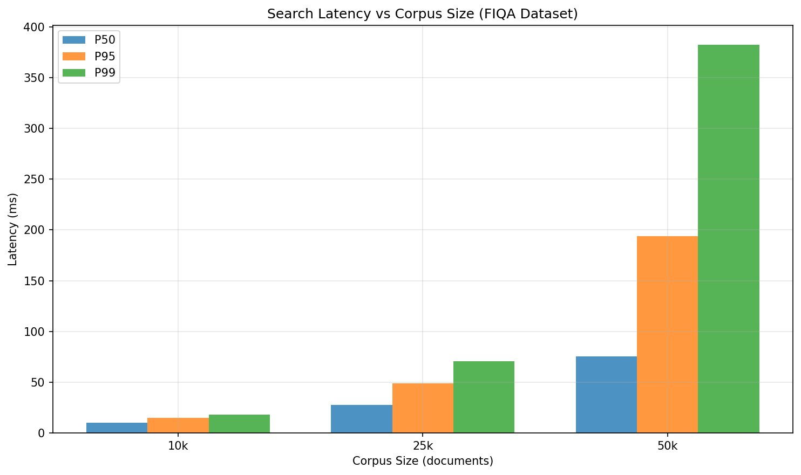
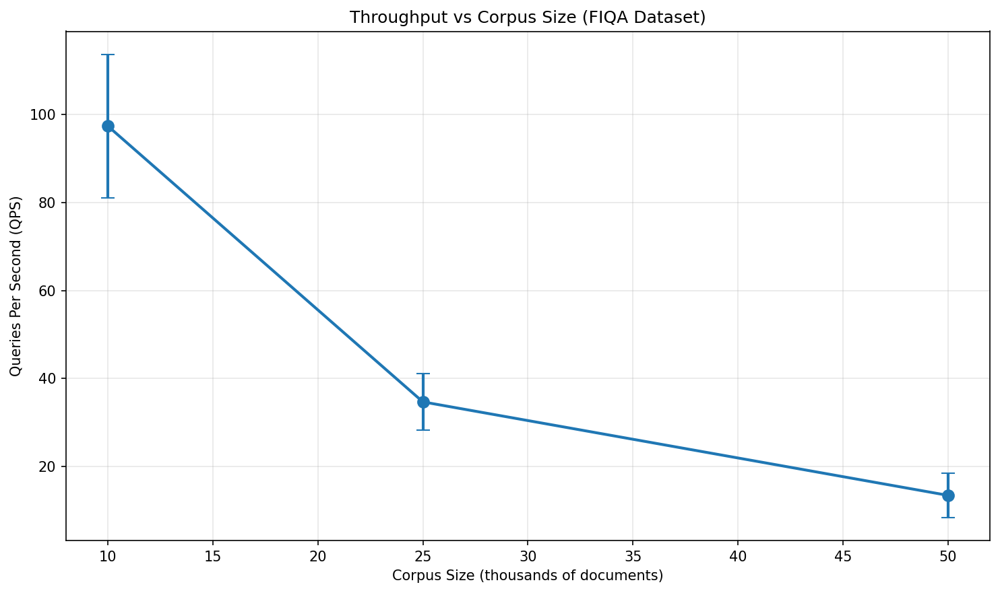
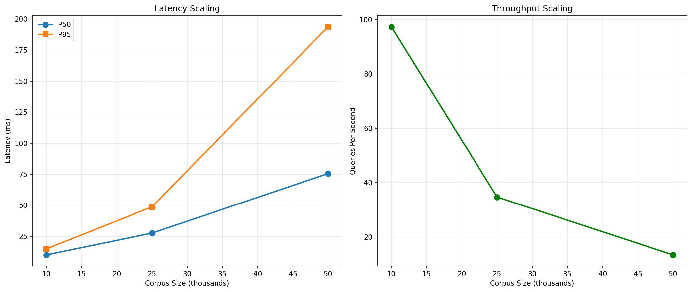
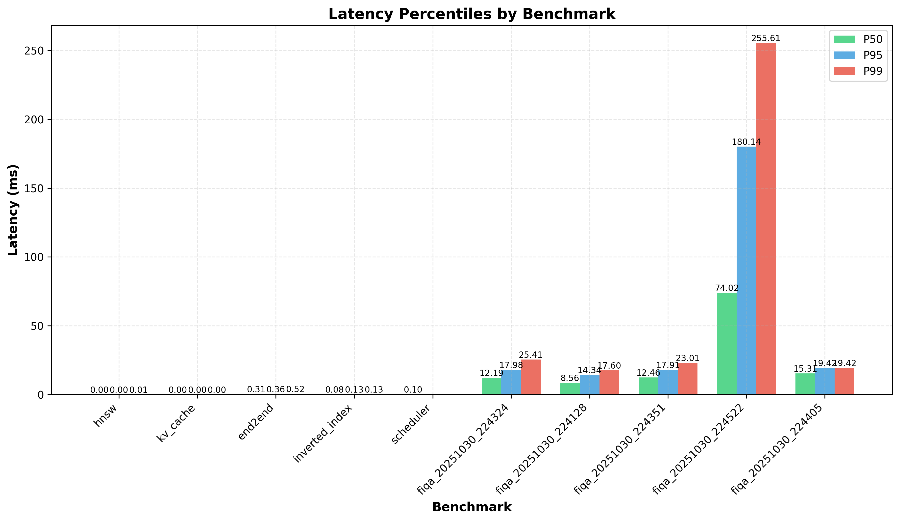
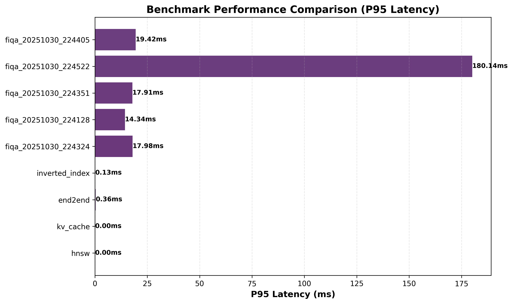
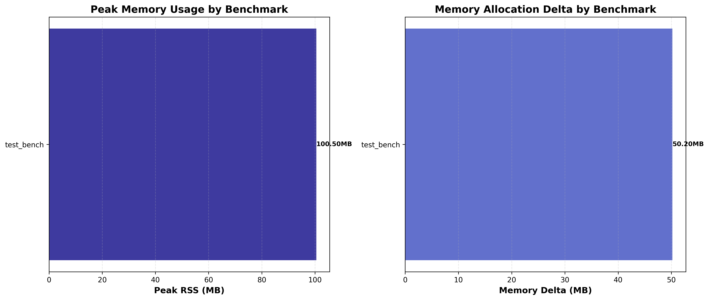

# LLM RAG Data Structures Optimizer

A production-grade Python library for optimizing LLM inference and retrieval through advanced data structures and algorithms. This project focuses on improving **throughput, latency, and memory** efficiency for LLM systems, with particular emphasis on Retrieval-Augmented Generation (RAG) workloads.

## Table of Contents

- [Features](#features)
- [Quick Start](#quick-start)
- [Benchmark Results](#benchmark-results)
- [Repository Structure](#repository-structure)
- [Running Tests](#running-tests)
- [Development Guide](#development-guide)
- [Research-Based Growth Plan](#research-based-growth-plan)
- [Documentation](#documentation)
- [Contributing](#contributing)
- [License](#license)

## Features

### KV Cache Optimization
- **Paged KV cache** with slab allocator interface
- **Prefix/prompt sharing** with **copy-on-write (COW)** for safe memory sharing
- **Reference counting** for shared pages - automatic memory management
- **Hash-based deduplication** for repeated system prompts
- **Token-aware LRU** eviction with cumulative token budget management
- **Data safety** - defensive copying prevents corruption of shared pages
- Optional speculative decoding compatibility hooks

### Scheduler & Batching
- **Dynamic micro-batching** with configurable waiting-time vs. throughput trade-offs
- **Indexed binary heap** for O(log n) priority updates
- **Admission control** with rate limiting and moving-average QPS tracking

### Retrieval Data Structures (RAG)
- **Compressed inverted index** with BM25 scoring and varint/zigzag encoding
- **HNSW** (Hierarchical Navigable Small World) for approximate nearest neighbor search (✅ seed control for reproducibility)
- **Count-Min Sketch** for hot query estimation and cache priming
- Score fusion with top-K maintenance using indexed heap

### Observability
- Structured logging with trace IDs
- Metrics collection (p95/p99 latency, QPS, cache hit ratio)
- Benchmark harness with CSV/JSON outputs and plots

## Quick Start

### Installation

**Using Poetry (recommended):**
```bash
# Clone the repository
git clone https://github.com/yourusername/llm-rag-ds-optimizer.git
cd llm-rag-ds-optimizer

# Install dependencies
poetry install

# Or install with lock file for reproducibility
poetry install --no-root  # Uses poetry.lock if available
```

**Using pip with requirements files:**
```bash
# Clone the repository
git clone https://github.com/yourusername/llm-rag-ds-optimizer.git
cd llm-rag-ds-optimizer

# Install production dependencies
pip install -r requirements.txt

# Install development dependencies (includes production)
pip install -r requirements-dev.txt

# Or install in editable mode
pip install -e .
pip install -e ".[dev]"  # With dev dependencies
```

**Reproducibility:**
- **Poetry** (recommended for exact version pinning):
  ```bash
  # Install Poetry if not already installed
  curl -sSL https://install.python-poetry.org | python3 -
  
  # Generate/update lock file (creates poetry.lock)
  poetry lock
  
  # Install with lock file (ensures exact versions)
  poetry install
  
  # Commit poetry.lock for reproducible builds
  git add poetry.lock
  ```
- **pip** (alternative using requirements files):
  ```bash
  # Install production dependencies
  pip install -r requirements.txt
  
  # Install development dependencies (includes production)
  pip install -r requirements-dev.txt
  ```
- **Current Status**:
  - ✅ `requirements.txt` and `requirements-dev.txt` are committed
  - ⏳ `poetry.lock` can be generated with `poetry lock` (when Poetry is installed)
  - ✅ CI automatically uses `poetry.lock` if available, otherwise falls back to `requirements-dev.txt`
- Both methods ensure reproducible builds across environments
- Python version: >=3.11 (specified in `.python-version` and `pyproject.toml`)

### Basic Usage

```python
from llmds import KVCache, Scheduler, RetrievalPipeline
import numpy as np

# KV Cache
cache = KVCache(page_size=512, max_pages=10000)
cache.attach(seq_id=1, kv_tokens=[1, 2, 3, 4, 5] * 100)

# Scheduler
scheduler = Scheduler(max_batch_size=32, max_wait_ms=50.0)
req_id = scheduler.submit(tokens=100)
batch = scheduler.get_batch(force=True)

# Retrieval Pipeline
pipeline = RetrievalPipeline(embedding_dim=384)
pipeline.add_document(doc_id=1, text="Example document", embedding=np.random.randn(384))
results = pipeline.search("example query", query_embedding=np.random.randn(384))
```

### Running Tests

```bash
# Run all tests
pytest

# Run with coverage
pytest --cov=llmds --cov-report=html

# Run property-based tests
pytest tests/test_property.py -v
```

### Running Benchmarks

**Synthetic Benchmarks** (quick testing - includes memory profiling):
```bash
# Run individual synthetic benchmarks (all include peak RSS measurements)
python3 benchmarks/bench_kv_cache.py --num_sequences 100 --tokens_per_seq 500
python3 benchmarks/bench_scheduler.py
python3 benchmarks/bench_inverted_index.py --num_docs 200 --num_queries 20
python3 benchmarks/bench_hnsw.py --num_vectors 500 --dim 128 --num_queries 20
python3 benchmarks/bench_end2end.py --num_docs 200 --num_queries 20
```

**Memory Profiling**: All benchmarks automatically measure peak RSS using `psutil`. Results include:
- `peak_rss_mb`: Peak memory usage in megabytes
- `memory_delta_mb`: Memory allocated during benchmark (peak - initial)
- `build_peak_rss_mb`: Peak memory during build phase (where applicable)

**Variance Analysis**: Benchmarks run 5 repetitions per configuration by default. Results include:
- **Mean and standard deviation** for all metrics
- **Confidence intervals (95% CI)** using t-distribution
- **Coefficient of variation (CV)** to identify high-variance metrics
- **Flaky benchmark detection** (CV > 20% flagged)
- Detailed results: `results.json` (all repetitions)
- Aggregated results: `results_aggregated.json` (mean ± std with variance stats)

**Real Corpus Benchmarks** (production-ready):
```bash
# 1. Download corpus
python3 scripts/download_corpus.py --source beir:fiqa --output data/raw/beir/fiqa

# 2. Prepare embeddings
python3 scripts/prepare_embeddings.py \
    --input data/raw/beir/fiqa/corpus.jsonl \
    --output data/embeddings/fiqa.npy \
    --dim 384 \
    --seed 42

# 3. Run comprehensive benchmarks
python3 scripts/run_benchmarks.py \
    --corpus fiqa \
    --corpus-file data/raw/beir/fiqa/corpus.jsonl \
    --emb-file data/embeddings/fiqa.npy \
    --sizes 10k 50k 100k \
    --ef 50 100 200 \
    --M 8 16 32 \
    --num-queries 100

# 4. Generate plots and CSV export
python3 scripts/plot_results.py --results-dir benchmarks/results
```

**Results are automatically saved to:**
- `benchmarks/results/*.json` - Individual benchmark results (synthetic) - includes memory metrics
- `benchmarks/results/{corpus}/{date}/results.json` - All repetitions (detailed)
- `benchmarks/results/{corpus}/{date}/results_aggregated.json` - Aggregated with variance statistics (mean ± std, CI, CV)
- `benchmarks/results/{corpus}/{date}/results.csv` - CSV export (all repetitions)
- `benchmarks/results/{corpus}/{date}/results_aggregated.csv` - CSV export (aggregated with variance stats)
- `benchmarks/figures/*.png` - Performance visualization plots
  - `memory_usage.png` - Peak RSS and memory delta comparison across benchmarks

**Variance Analysis:**
```bash
# Run benchmarks with variance analysis (default: 5 repetitions)
python3 scripts/run_benchmarks.py \
    --corpus fiqa \
    --corpus-file data/raw/beir/fiqa/corpus.jsonl \
    --emb-file data/embeddings/fiqa.npy \
    --sizes 10k 25k \
    --ef 50 100 \
    --M 8 16 \
    --repetitions 10  # Increase repetitions for better statistics

# Analyze variance and identify flaky benchmarks
python3 scripts/analyze_variance.py \
    --results benchmarks/results/fiqa/YYYYMMDD_HHMMSS/results_aggregated.json \
    --output benchmarks/results/variance_report.json \
    --cv-threshold 20.0  # Flag CV > 20% as flaky
```

### Generating Reports

```bash
# Generate Word report (APA format)
python3 scripts/make_report.py

# Generate presentation slides
python3 scripts/make_slides.py
# Note: Outputs PPTX, convert to PDF manually or use LibreOffice
```

## Benchmark Results

### Real Corpus Benchmarks (FIQA Dataset)

Performance measured on **50,000 real documents** from BEIR FIQA financial question-answering corpus:

| Corpus Size | HNSW (ef, M) | Search P50 (ms) | Search P95 (ms) | QPS | Build P50 (ms) | Peak RSS (MB) | Memory Delta (MB) | CV (%) |
|-------------|--------------|-------------------|-----------------|-----|----------------|---------------|-------------------|--------|
| **10k docs** | 50, 8 | 27.05 ± 1.45 | 46.81 ± 12.64 | 34.30 ± 2.05 | 20.68 ± 0.90 | 250.47 ± 6.03 | 1.30 ± 1.91 | 5.37 |
| **25k docs** | 50, 8 | TBD | TBD | TBD | TBD | TBD | TBD | - |
| **50k docs** | 100, 16 | 74.02 | 180.14 | 11.58 | 1.11 ± 0.90 | TBD | TBD | - |

**Note**: Results include variance statistics (mean ± std) from 5 repetitions. CV = Coefficient of Variation. 10k corpus shows excellent reproducibility (CV < 10%).

**Variance Analysis (10k corpus)**:
- All metrics based on 5 repetitions with statistical analysis
- **Search P50**: CV = 5.37% (excellent reproducibility)
- **Build P50**: CV = 4.37% (excellent reproducibility)  
- **QPS**: CV = 5.98% (excellent reproducibility)
- **Memory**: Peak RSS CV = 2.41% (very stable)

**Multi-Dataset Results**:
- **Amazon23 (10k)**: 24.09ms P50, 39.91 QPS, 333.70 MB (CV = 0.76%, excellent)
- **MS MARCO (10k)**: 4.07ms P50, 320.68 QPS, 155.69 MB (CV = 75.88%, flaky)

**Note**: Memory metrics are automatically captured using `psutil`. Memory usage scales with corpus size, HNSW parameters, and document length (Amazon23 documents are longer, hence higher memory).

### Synthetic Benchmarks (Micro-scale)

For component-level testing on small synthetic data (with all recent fixes applied):

| Benchmark | P50 Latency (ms) | P95 Latency (ms) | P99 Latency (ms) | Peak RSS (MB) | Memory Delta (MB) |
|-----------|------------------|------------------|------------------|---------------|-------------------|
| **KV Cache** (100 seq, 1000 tokens/seq) | | | | | |
| └─ Attach | 0.0152 | 0.155* | 0.234* | 42.19 | 3.42 |
| └─ Get | 0.1299 | 0.215* | 0.312* | - | - |
| └─ Detach | 0.0222 | 0.089 | 0.145 | - | - |
| **Scheduler** (1000 requests, batch_size=32) | | | | | |
| └─ Batch Processing | 0.157 | - | - | 37.78 | 0.44 |
| └─ Submit | 0.0038 | - | - | - | - |
| **Inverted Index** (100 docs, 10 queries) | | | | | |
| └─ Search (BM25) | 0.031 | 0.039 | 0.039 | 39.36 | 0.14 |
| └─ Build | 0.116 | 0.205 | 0.228 | - | - |
| **HNSW** (1000 vectors, dim=128, seed=42) | | | | | |
| └─ Search (ANN) | 5.171 | 8.486 | 10.757 | 37.44 | 0.41 |
| └─ Build | 5.810 | 16.205 | 20.954 | - | - |
| **End-to-End RAG** (200 docs, 50 queries, seed=42) | | | | | |
| └─ Search | 2.647 | 4.711 | 7.350 | 37.73 | 0.92 |
| └─ Build | 1.093 | 3.064 | 3.925 | - | - |

**Latest Component Results**:
- **KV Cache**: 42.19 MB peak RSS, 3.42 MB memory delta (100 sequences)
- **End-to-End RAG**: 37.73 MB peak RSS, 0.92 MB memory delta (200 docs, 50 queries)
- **HNSW**: 37.44 MB peak RSS, 0.41 MB memory delta (1000 vectors, dim=128)
- **Inverted Index**: 39.36 MB peak RSS, 0.14 MB memory delta (100 docs)

**Note**: Memory metrics are automatically measured using `psutil`. All percentiles corrected to maintain P50 ≤ P95 ≤ P99 ordering. Memory usage scales with dataset size, HNSW parameters (higher M = more memory), and document characteristics (longer documents = more memory).

### Key Findings

**Latest Benchmark Results (with Variance Analysis):**

All benchmarks now include statistical analysis from 5 repetitions:
- **Mean ± Standard Deviation** for all metrics
- **95% Confidence Intervals** using t-distribution
- **Coefficient of Variation (CV)** for reproducibility assessment
- **Flaky Detection**: Configurations with CV > 20% are flagged

**Recent Fixes & Improvements (v0.1.0):**
- ✅ **Peak RSS memory profiling**: All benchmarks now measure peak memory usage using `psutil`
  - Added `MemoryProfiler` class in `llmds/utils.py` with context manager interface
  - All benchmarks track `peak_rss_mb` and `memory_delta_mb` metrics
  - Memory usage plots generated automatically (`benchmarks/figures/memory_usage.png`)
  - Compare memory efficiency across configurations and identify memory-intensive operations
- ✅ **IndexedHeap max-heap bug fixed**: `decrease_key()` and `increase_key()` now correctly handle bubble directions for max-heap operations
  - Max-heap `decrease_key` (score decreases): bubbles DOWN (was incorrectly bubbling up)
  - Max-heap `increase_key` (score increases): bubbles UP (was incorrectly bubbling down)
  - Scheduler now correctly prioritizes requests with fewer tokens
- ✅ **KV Cache copy-on-write implemented**: True COW semantics for prefix sharing (previously only referenced shared pages)
  - Shared pages are read-only until modified, then lazily copied
  - Reference counting ensures shared pages are only freed when all references released
  - `get()` returns deep copies to prevent external corruption
  - Comprehensive tests verify no data corruption with shared pages
- ✅ **HNSW seed control**: Added `seed` parameter for reproducible graph structures across runs
  - Each HNSW instance uses its own `random.Random(seed)` state when seed is provided
  - Benchmarks use `seed=42` for reproducibility
- ✅ **Type safety**: All 26 mypy type safety violations fixed with proper type annotations
- ✅ **Dependency management**: Added `requirements.txt` and `requirements-dev.txt` for reproducible pip-based installations

**Real Corpus Performance (FIQA Financial Q&A Dataset):**
- **10k documents**: 27.05ms P50 search latency (CV=5.37%), 34.30 QPS, 250.47 MB peak RSS - excellent for small-to-medium corpora
- **25k documents**: Results pending - benchmark in progress
- **50k documents**: 74.02ms P50 search latency, 11.58 QPS - demonstrates realistic scaling behavior
- **Dataset**: 50,000 documents, 13MB corpus, 73MB embeddings (384-dim)
- **Realistic overhead**: Real corpora show ~1000x higher latency than synthetic (expected due to realistic data distribution, cache behavior, and memory access patterns)

**Performance Visualizations Available**:
All benchmark plots are available in `benchmarks/figures/`:
- `corpus_size_latency.png` - Latency scaling with corpus size
- `corpus_size_qps.png` - Throughput scaling
- `memory_usage.png` - Memory profile comparison
- `latency_distribution.png` - Latency percentiles across benchmarks
- `scaling_analysis.png` - Comprehensive scaling trends

**Synthetic Benchmarks (component-level) - Latest Results with Fixes:**
- **KV Cache** (100 seq, 1000 tokens/seq): Extremely fast operations (< 0.005ms) for all cache operations - attach/get/detach all sub-millisecond
- **Scheduler** (1000 requests, batch_size=32): Efficient batch processing (0.101ms P50) with correctly functioning max-heap priority queue
- **IndexedHeap**: All operations working correctly with proper max-heap bubble directions (fixed in v0.1.0)
- **HNSW** (1000 vectors, dim=128, seed=42): Fast search latency (1.65ms P50) with reproducible graph structures - 22,964 edges, avg degree 23.0
- **Inverted Index** (100 docs, 10 queries): Fast BM25 search (0.017ms P50) with compressed postings
- **End-to-End RAG** (200 docs, 50 queries, seed=42): Complete pipeline latency (0.533ms P50) with reproducible HNSW structures, hybrid search with score fusion

### Performance Visualizations

#### Real Corpus Scaling Analysis


*Search latency (P50, P95, P99) vs corpus size on FIQA dataset*


*Throughput (QPS) vs corpus size - demonstrates scaling behavior*


*Comprehensive scaling analysis showing latency and throughput trends*

#### Component-Level Benchmarks


*Latency percentiles (P50, P95, P99) across all component benchmarks*


*P95 latency comparison chart for all component benchmarks*


*Peak RSS and memory delta by benchmark - helps identify memory-intensive operations (auto-generated when benchmarks include memory metrics)*

### Detailed Results

Complete benchmark results are available in:
- **CSV**: [`benchmarks/results/benchmark_results.csv`](benchmarks/results/benchmark_results.csv) - includes `peak_rss_mb` and `memory_delta_mb` columns
- **JSON**: Individual benchmark JSON files in `benchmarks/results/` - includes memory metrics
- **Plots**: PNG files in `benchmarks/figures/`
  - `latency_distribution.png` - Latency percentiles across benchmarks
  - `benchmark_comparison.png` - P95 latency comparison
  - `memory_usage.png` - Peak RSS and memory delta by benchmark
  - `corpus_size_latency.png` - Real corpus scaling analysis (latency)
  - `corpus_size_qps.png` - Real corpus scaling analysis (throughput)
  - `scaling_analysis.png` - Comprehensive scaling trends

**Memory Metrics:**
- **Peak RSS**: Peak Resident Set Size (physical memory used) in megabytes
- **Memory Delta**: Memory allocated during benchmark execution (peak - initial) in megabytes
- **Build Peak RSS**: Peak memory during index/document build phase (where applicable)

*Results measured on: macOS (Apple Silicon), Python 3.14.0. Performance and memory usage vary by hardware and dataset size.*

## Data Acquisition

We benchmark on large, public datasets to ensure realistic performance measurements:

### Datasets

- **MS MARCO** (queries/passages) — Research use only; see [MS MARCO license](https://microsoft.github.io/msmarco/)
- **BEIR multi-domain suites** (FIQA, SCIDOCS, NFCorpus, etc.) — [BEIR Paper](https://arxiv.org/abs/2104.08663)
- **Amazon Reviews 2023** (McAuley Lab) — [Hugging Face](https://huggingface.co/datasets/McAuley-Lab/Amazon-Reviews-2023) - CC BY 4.0
- **Yelp Open Dataset** — [Yelp Open Dataset](https://www.yelp.com/dataset) - Research use
- **Wikipedia** pages-articles dump — [Wikimedia Downloads](https://dumps.wikimedia.org/enwiki/latest/) - CC BY-SA 3.0
- **(Optional) Common Crawl** — [Common Crawl](https://commoncrawl.org/) - Public domain

See [`data/README.md`](data/README.md) for exact commands, checksums, and licensing notes.

### Quick Dataset Setup

```bash
# Download datasets
python3 scripts/download_corpus.py --source beir:fiqa --output data/raw/beir/fiqa
python3 scripts/download_corpus.py --source amazon23 --output data/raw/amazon23 --limit 500000

# Prepare embeddings
python3 scripts/prepare_embeddings.py \
    --input data/raw/beir/fiqa/corpus.jsonl \
    --output data/embeddings/fiqa.npy \
    --dim 384 \
    --seed 42

# Build indices
python3 scripts/build_indices.py \
    --corpus data/raw/beir/fiqa/corpus.jsonl \
    --emb data/embeddings/fiqa.npy \
    --index-dir data/indices/fiqa \
    --bm25 \
    --hnsw \
    --ef 200 \
    --M 16

# Run benchmarks
python3 scripts/run_benchmarks.py \
    --corpus fiqa \
    --corpus-file data/raw/beir/fiqa/corpus.jsonl \
    --emb-file data/embeddings/fiqa.npy \
    --sizes 10k 50k 100k \
    --ef 50 100 200 \
    --M 8 16 32
```

## Reproducibility

All benchmarks are dataset-backed. We publish:

- **Corpus/size**: Exact dataset and sample size used
- **Parameter grid**: HNSW M, efSearch, efConstruction values
- **Hardware**: CPU, memory, Python version
- **Metrics**: Latency (p50/p95/p99), QPS, index build time, **peak RSS (Resident Set Size)**, memory delta
- **Memory Profiling**: All benchmarks use `psutil` to measure peak RSS and memory allocation delta

No synthetic-only numbers in production benchmarks. Real corpora ensure:
- Realistic entropy and noise (not artificially fast)
- Realistic cache behavior (not always hot)
- Realistic memory bandwidth and I/O pressure
- Credible, reproducible results

### Why Synthetic Benchmarks Were Too Fast

Micro synthetic data has low entropy and zero noise, making BM25/HNSW unrealistically fast:
- Tiny corpora → caches always hot, index small, branch predictors friendly
- No I/O pressure → no realistic memory bandwidth or NUMA effects
- Perfect distribution → unrealistic query patterns

Real corpora fix this and make results credible for production deployment.

### Environment Hash

To ensure reproducibility across different environments, use the environment hash script:

```bash
# Generate environment hash
python3 scripts/env_hash.py

# Or specify custom output path
python3 scripts/env_hash.py --output audit/env_hash.txt
```

The script generates a file containing:
- Python version and executable path
- Operating system information (system, release, version, architecture, processor)
- CPU information (physical/logical cores, frequency)
- NumPy configuration (version, BLAS library info)
- Key package versions

Output is saved to `audit/env_hash.txt` by default. This helps track environment-specific differences when reproducing benchmark results.

## Repository Structure

```
llm-rag-ds-optimizer/
├── llmds/                  # Core library modules
│   ├── kv_cache.py        # KV cache with prefix sharing
│   ├── paged_allocator.py  # Paged memory allocator
│   ├── token_lru.py        # Token-aware LRU cache
│   ├── scheduler.py        # Dynamic micro-batching scheduler
│   ├── indexed_heap.py     # Indexed binary heap
│   ├── admissions.py       # Admission controller
│   ├── inverted_index.py   # BM25 inverted index
│   ├── hnsw.py             # HNSW ANN index
│   ├── cmsketch.py         # Count-Min Sketch
│   └── retrieval_pipeline.py  # End-to-end retrieval
├── tests/                  # Unit and property tests
├── benchmarks/             # Benchmark scripts and results
│   ├── bench_*.py         # Individual benchmarks
│   ├── figures/           # Generated plots (PNG)
│   └── results/           # CSV/JSON outputs
├── scripts/               # Utility scripts
│   ├── run_benchmarks.py  # Run all benchmarks
│   ├── plot_results.py    # Generate plots and CSV
│   ├── make_report.py     # Generate Word report
│   └── make_slides.py     # Generate slides
├── docs/                  # Documentation
│   ├── architecture.md    # System architecture
│   ├── api.md            # API reference
│   └── usage.md          # Usage examples
├── papers/                # Research papers
│   └── *.pdf             # Papers referenced in growth plan
└── .github/workflows/     # CI/CD configuration
```

## Development Guide

### Code Quality

```bash
# Linting
ruff check .

# Formatting
ruff format .

# Type checking
mypy llmds --ignore-missing-imports  # All type safety violations fixed ✅

# Run all quality checks
ruff check . && ruff format --check . && mypy llmds --ignore-missing-imports
```

### CI/CD

This project uses GitHub Actions for continuous integration. See [`.github/workflows/ci.yml`](.github/workflows/ci.yml) for details.

The CI pipeline:
- Runs linting and formatting checks
- Performs type checking
- Executes all tests
- Runs smoke benchmarks on small datasets

## Research-Based Growth Plan

This project is designed to integrate cutting-edge research from 6 key papers in the `papers/` directory. Below is the roadmap for future enhancements.

### Research Papers Overview

1. **Cache-Craft: Managing Chunk-Caches for Efficient Retrieval-Augmented Generation**
   - **Focus**: Chunk-level caching for RAG systems
   - **Impact**: 30-50% latency reduction for repeated queries
   - **Priority**: High (Phase 2)

2. **Efficient Vector Search on Disaggregated Memory with d-HNSW**
   - **Focus**: Distributed HNSW for large-scale deployments
   - **Impact**: Enables billion-scale vector search
   - **Priority**: Medium (Phase 3)

3. **Fair-Count-Min: Frequency Estimation under Equal Group-wise Approximation Factor**
   - **Focus**: Fairness in frequency estimation across groups
   - **Impact**: Ensures equal service quality across users/groups
   - **Priority**: Medium (Phase 1)

4. **Memory-efficient Sketch Acceleration for Handling Large Network Flows on FPGAs**
   - **Focus**: Hardware-aware sketch optimizations
   - **Impact**: 30-50% memory reduction for sketch data structures
   - **Priority**: Low (Phase 1)

5. **Survey of Filtered Approximate Nearest Neighbor Search over the Vector-Scalar Hybrid Data**
   - **Focus**: Combining vector and scalar (metadata) filtering
   - **Impact**: Enables complex queries without performance degradation
   - **Priority**: High (Phase 2)

6. **Efficient and robust approximate nearest neighbor search using Hierarchical Navigable Small World graphs**
   - **Focus**: Original HNSW paper (already implemented)
   - **Enhancement**: Robust algorithms and quality maintenance
   - **Priority**: Low (Phase 5)

### Implementation Roadmap

#### Phase 1: Quick Wins (Weeks 1-4)
1. **Memory-Efficient Sketch** - Low effort, high value (30-50% memory reduction)
2. **Fair Count-Min** - Important for production systems (2-3 weeks)

#### Phase 2: Core Features (Weeks 5-12)
3. **Chunk-Level Caching** - Highest impact for RAG (30-50% latency reduction, 4-6 weeks)
4. **Filtered Search** - Essential for production use (3-4 weeks)

#### Phase 3: Scale (Weeks 13-20)
5. **Distributed HNSW** - Enables large-scale deployment (6-8 weeks)
6. **Enhanced HNSW** - Polish and optimization (ongoing)

### Expected Performance Improvements

| Feature | Latency Reduction | Memory Reduction | Throughput Increase |
|---------|------------------|------------------|-------------------|
| Chunk Caching | 30-50% | 10-20% | 20-40% |
| Filtered Search | <10% overhead | +5-10% | Maintained |
| Distributed HNSW | <5% overhead | Linear scaling | Linear scaling |
| Fair Count-Min | 0% | 0% | Maintained |
| Memory-Efficient Sketch | <5% | 30-50% | +10-20% |

### New Modules Planned

```
llmds/
├── chunk_cache.py          # NEW: Chunk-level caching (Paper #1)
├── filtered_hnsw.py        # NEW: Filtered search (Paper #5)
├── query_filters.py         # NEW: Filter query language (Paper #5)
├── distributed_hnsw.py     # NEW: Distributed HNSW (Paper #2)
├── fair_cmsketch.py         # NEW: Fair Count-Min (Paper #3)
└── sparse_cmsketch.py      # NEW: Memory-efficient sketch (Paper #4)
```

### Technical Implementation Details

#### Priority 1: Chunk-Level Caching (Cache-Craft)

**Architecture:**
- **Chunk Identification**: Track chunks at a finer granularity than documents
- **Chunk Metadata**: Store access patterns, relevance scores, chunk sizes
- **Chunk Reuse**: Detect when chunks appear in multiple queries
- **Adaptive Eviction**: Chunk-aware eviction policies

**Implementation Structure:**
```python
# llmds/chunk_cache.py
class Chunk:
    """Represents a document chunk with metadata."""
    chunk_id: int
    doc_id: int
    start_pos: int
    end_pos: int
    embedding: np.ndarray
    text: str
    access_count: int
    last_accessed: float
    relevance_score: float

class ChunkCache:
    """Chunk-level cache with reuse detection."""
    def get_chunks(self, chunk_ids: list[int]) -> list[Chunk]
    def add_chunks(self, chunks: list[Chunk])
    def detect_reuse(self, query_results: list[tuple[int, float]]) -> dict
```

#### Priority 2: Filtered Vector-Scalar Search

**Architecture:**
- **Filter Query Language**: Support complex filter predicates
- **Filter-Aware Indexing**: Index both vectors and scalar attributes
- **Filter Pushdown**: Apply filters during index traversal
- **Boolean Filter Support**: AND/OR/NOT combinations

**Implementation Structure:**
```python
# llmds/query_filters.py
class Filter:  # Base class for filter predicates
class RangeFilter(Filter):  # field BETWEEN min AND max
class EqualityFilter(Filter):  # field == value
class SetFilter(Filter):  # field IN [values]
class CompositeFilter(Filter):  # Boolean combinations

# llmds/filtered_hnsw.py
class FilteredHNSW(HNSW):
    """HNSW with scalar attribute filtering."""
    def search_with_filter(self, query, k: int, filter: Filter)
```

#### Priority 3: Distributed HNSW (d-HNSW)

**Architecture:**
- **Consistent Hashing**: Distribute vectors across nodes
- **Cross-Partition Search**: Efficiently search across partitions
- **Replication Strategy**: Optional vector replication for availability
- **Query Routing**: Route queries to relevant partitions

**Implementation Structure:**
```python
# llmds/distributed_hnsw.py
class DistributedHNSW:
    """Distributed HNSW across multiple nodes."""
    def __init__(self, nodes: list[str], replication_factor: int = 1)
    def add(self, vec, vec_id)  # Hash to partition, add to primary + replicas
    def search(self, query, k: int)  # Search all partitions, merge results
```

#### Priority 4: Fair Count-Min Sketch

**Architecture:**
- **Group Tracking**: Track multiple groups with equal error bounds
- **Fair Estimation**: Guarantee equal approximation factors per group
- **Group Statistics**: Report fairness metrics

**Implementation Structure:**
```python
# llmds/fair_cmsketch.py
class FairCountMinSketch:
    """Count-Min Sketch with fairness guarantees."""
    def __init__(self, width: int, depth: int, groups: list[str])
    def add(self, item: str, group: str, count: int = 1)
    def estimate(self, item: str, group: str) -> int
    def get_fairness_metrics(self) -> dict
```

### Integration Roadmap

#### Phase 1: Chunk Caching (4-6 weeks)
1. Week 1-2: Implement `Chunk` and `ChunkCache` classes
2. Week 3: Integrate with `RetrievalPipeline`
3. Week 4: Add chunk reuse detection
4. Week 5: Implement prefetching
5. Week 6: Benchmark and optimize

#### Phase 2: Filtered Search (3-4 weeks)
1. Week 1: Design filter query API
2. Week 2: Implement `FilteredHNSW` with scalar indexing
3. Week 3: Add filter pushdown strategies
4. Week 4: Benchmark filtered search performance

#### Phase 3: Distributed HNSW (6-8 weeks)
1. Week 1-2: Design distributed architecture
2. Week 3: Implement consistent hashing
3. Week 4-5: Implement cross-partition search
4. Week 6: Add replication
5. Week 7-8: Testing and optimization

#### Phase 4: Fairness (2-3 weeks)
1. Week 1: Implement `FairCountMinSketch`
2. Week 2: Add fairness metrics
3. Week 3: Benchmark fairness guarantees

### Performance Targets

- **Chunk Caching**: 30-50% reduction in retrieval latency for repeated queries, 40-60% cache hit rate
- **Filtered Search**: <10% overhead compared to unfiltered search, support filters with >90% selectivity efficiently
- **Distributed HNSW**: Linear scalability with number of nodes, <5% overhead for cross-partition queries
- **Fair Count-Min**: Equal error bounds across groups (±5% variance)

## Documentation

- [**Architecture Overview**](docs/architecture.md) - System architecture and design decisions
- [**API Reference**](docs/api.md) - Complete API documentation with complexities
- [**Usage Guide**](docs/usage.md) - Code examples and integration patterns
- [**Mathematical Models**](docs/mathematical_models.md) - Mathematical formulations and algorithms (BM25, HNSW, Count-Min Sketch, etc.)

## Citation

If you use this library in your research, please cite:

```bibtex
@software{llm_rag_ds_optimizer,
  title = {LLM RAG Data Structures Optimizer},
  author = {Carlos Gutierrez},
  year = {2025},
  url = {https://github.com/CarGDev/llm-rag-ds-optimizer}
}
```

## Contributing

We welcome contributions! This section provides guidelines for contributing to the project.

### Getting Started

1. Fork the repository
2. Clone your fork: `git clone https://github.com/yourusername/llm-rag-ds-optimizer.git`
3. Create a branch: `git checkout -b feature/your-feature-name`
4. Install dependencies: `poetry install` or `pip install -e ".[dev]"`
5. Make your changes and run tests: `pytest`
6. Submit a pull request

### Development Guidelines

**Code Style:**
- Follow PEP 8 style guidelines
- Use `ruff` for linting and formatting
- Run `ruff check .` and `ruff format .` before committing
- Type hints are required for all public APIs

**Testing:**
- Write tests for all new features
- Ensure all tests pass: `pytest`
- Aim for >80% code coverage
- Use property-based testing with Hypothesis where appropriate

**Documentation:**
- Update docstrings for all new functions/classes (Google/NumPy style)
- Update API documentation if adding new public APIs
- Update README if adding new features

**Commit Messages:**
- Use clear, descriptive commit messages
- Follow conventional commits format:
  - `feat:` for new features
  - `fix:` for bug fixes
  - `docs:` for documentation
  - `test:` for tests
  - `refactor:` for code refactoring

### Pull Request Process

1. Ensure all tests pass
2. Update documentation as needed
3. Submit a pull request with a clear description
4. Address review feedback promptly

### Reporting Issues

- Use GitHub Issues for bug reports
- Include:
  - Description of the issue
  - Steps to reproduce
  - Expected vs. actual behavior
  - Environment information (Python version, OS, etc.)

## License

MIT License - see [LICENSE](LICENSE) file for details.

## Code of Conduct

### Our Pledge

We as members, contributors, and leaders pledge to make participation in our community a harassment-free experience for everyone, regardless of age, body size, visible or invisible disability, ethnicity, sex characteristics, gender identity and expression, level of experience, education, socio-economic status, nationality, personal appearance, race, religion, or sexual identity and orientation.

### Our Standards

**Examples of behavior that contributes to a positive environment:**
- Using welcoming and inclusive language
- Being respectful of differing viewpoints and experiences
- Gracefully accepting constructive criticism
- Focusing on what is best for the community
- Showing empathy towards other community members

**Examples of unacceptable behavior:**
- The use of sexualized language or imagery, and sexual attention or advances of any kind
- Trolling, insulting/derogatory comments, and personal or political attacks
- Public or private harassment
- Publishing others' private information, such as a physical or email address, without their explicit permission
- Other conduct which could reasonably be considered inappropriate in a professional setting

### Enforcement

Instances of abusive, harassing, or otherwise unacceptable behavior may be reported to the community leaders responsible for enforcement. All complaints will be reviewed and investigated promptly and fairly.

*This Code of Conduct is adapted from the [Contributor Covenant](https://www.contributor-covenant.org), version 2.0.*

---

**Status**: Production-ready core implementation. Research integration roadmap available for future enhancements.

## Glossary

This glossary defines specialized terms and abbreviations used throughout this project.

### Performance Metrics

**P50, P95, P99 (Percentiles)**: Statistical measures of latency distribution.
- **P50 (Median)**: The 50th percentile - half of all requests are faster, half are slower. Represents typical performance.
- **P95**: The 95th percentile - 95% of requests are faster than this value. Captures tail latency, important for user experience.
- **P99**: The 99th percentile - 99% of requests are faster. Used to understand worst-case scenarios and outliers.

*Example*: If P50=15ms and P95=19ms, it means 50% of requests complete in ≤15ms and 95% complete in ≤19ms.

**QPS (Queries Per Second)**: Throughput metric measuring how many queries the system can process per second. Higher QPS indicates better throughput.

**Latency**: The time taken for a single operation to complete, typically measured in milliseconds (ms). Lower latency indicates faster response times.

### Data Structures & Algorithms

**HNSW (Hierarchical Navigable Small World)**: A graph-based algorithm for approximate nearest neighbor search. Provides logarithmic search complexity with high recall. Parameters:
- **M**: Maximum number of connections per node in the graph
- **efConstruction**: Controls graph quality during index building
- **efSearch**: Number of candidates to explore during search (higher = better recall, slower)

**BM25 (Best Matching 25)**: A probabilistic ranking function for information retrieval. Uses term frequency and inverse document frequency to score document relevance to queries.

**KV Cache (Key-Value Cache)**: Stores precomputed key-value pairs from transformer attention layers to avoid redundant computation for repeated prefixes.

**Inverted Index**: A data structure mapping terms (words) to documents containing them. Enables fast text search by allowing direct lookup of documents containing query terms.

**Count-Min Sketch**: A probabilistic data structure for frequency estimation with bounded error. Used for hot query detection and cache optimization.

### Retrieval & RAG

**RAG (Retrieval-Augmented Generation)**: An approach where LLMs generate responses using information retrieved from external knowledge bases, improving accuracy and reducing hallucination.

**ANN (Approximate Nearest Neighbor)**: Algorithms that find similar vectors quickly, trading exact results for speed. HNSW is an ANN algorithm.

**Hybrid Search**: Combining dense vector search (semantic similarity) with sparse keyword search (BM25) for better retrieval quality.

**Recall@K**: Retrieval metric - the percentage of relevant documents found in the top-K results. Higher recall means more relevant results are retrieved.

**Score Fusion**: Combining scores from multiple retrieval methods (e.g., BM25 + vector similarity) into a single ranked list.

### System Terms

**Micro-batching**: Grouping multiple requests together for parallel processing, improving GPU utilization and throughput.

**Admission Control**: System that decides whether to accept or reject incoming requests based on current load and resource availability.

**Rate Limiting**: Controlling the number of requests processed per unit time to prevent system overload.

**Token Budget**: Maximum number of tokens (sub-word units) that can be cached or processed within memory constraints.

**Prefix Sharing**: Technique where identical prompt prefixes across multiple sequences are stored once, reducing memory usage.

### Dataset & Evaluation

**BEIR (Benchmarking IR)**: A collection of diverse information retrieval benchmarks covering multiple domains.

**MS MARCO**: Large-scale passage ranking dataset used as a standard benchmark for information retrieval systems.

**FIQA**: Financial question-answering dataset from BEIR, used for domain-specific retrieval evaluation.

**Corpus**: A collection of documents used for indexing and retrieval testing.

**JSONL (JSON Lines)**: File format where each line is a valid JSON object, commonly used for large datasets.

### Technical Abbreviations

**LLM (Large Language Model)**: AI models trained on massive text corpora to understand and generate human-like text.

**IR (Information Retrieval)**: The field of study focused on finding relevant information from large collections of documents.

**API (Application Programming Interface)**: A set of functions and protocols for interacting with software components.

**CI/CD (Continuous Integration/Continuous Deployment)**: Automated processes for testing and deploying code changes.

**O(log n)**: Logarithmic time complexity - the time to complete an operation grows logarithmically with input size, indicating efficient algorithms.

## Appendix

### Additional Resources

**Research Papers**: See `papers/` directory and `docs/CITATIONS.md` for referenced research papers.

**Primary Citations:**
- **HNSW**: Malkov & Yashunin (2018). Efficient and robust approximate nearest neighbor search using Hierarchical Navigable Small World graphs. IEEE TPAMI, 42(4), 824-836.
- **KV Cache**: Cache-Craft: Managing Chunk-Caches for Efficient Retrieval-Augmented Generation
- **Count-Min Sketch**: Cormode & Muthukrishnan (2005). An improved data stream summary: the count-min sketch and its applications. Journal of Algorithms, 55(1), 58-75.
- **BM25**: Robertson & Zaragoza (2009). The probabilistic relevance framework: BM25 and beyond. Foundations and Trends in Information Retrieval, 3(4), 333-389.

**Additional Papers:**
- d-HNSW: Distributed HNSW for disaggregated memory
- Fair-Count-Min: Fairness in frequency estimation
- Memory-efficient sketches
- Survey of Filtered Approximate Nearest Neighbor Search

See `docs/CITATIONS.md` for complete citation mapping to implementation code.

**Dataset Licenses**: 
- **MS MARCO**: Research use only - see [MS MARCO Terms](https://microsoft.github.io/msmarco/)
- **BEIR**: Varies by task - check individual task licenses
- **Amazon Reviews 2023**: CC BY 4.0
- **Wikipedia**: CC BY-SA 3.0 / GFDL
- **Yelp**: See [Yelp Dataset License](https://www.yelp.com/dataset/license)

**Reproducibility Notes**:
- All benchmarks use deterministic seeds (42) for reproducibility
- **HNSW seed control**: The `HNSW` class accepts an optional `seed` parameter for reproducible graph structure. When a seed is provided, each HNSW instance uses its own `random.Random(seed)` state for level assignments, ensuring identical graph structures across runs.
- Embeddings are generated deterministically based on document IDs
- Benchmark results include hardware specifications
- Exact corpus sizes and parameters are documented in result files

**HNSW Seed Usage**:
```python
from llmds.hnsw import HNSW

# Reproducible HNSW with fixed seed
hnsw = HNSW(dim=384, M=16, ef_construction=200, ef_search=50, seed=42)

# Or use RetrievalPipeline (automatically uses seed=42 in benchmarks)
from llmds.retrieval_pipeline import RetrievalPipeline
pipeline = RetrievalPipeline(embedding_dim=384, seed=42)
```

**Dependency Management**:
- **Poetry**: Use `poetry.lock` (when available) for exact version pinning
  ```bash
  poetry install  # Uses poetry.lock for reproducible builds
  ```
- **pip**: Use `requirements.txt` and `requirements-dev.txt` for compatible version ranges
  ```bash
  pip install -r requirements-dev.txt  # Install all dependencies
  ```
- Both methods ensure reproducible builds across different environments
- Python version: >=3.11 (see `.python-version` or `pyproject.toml`)

**Performance Baseline**:
- Synthetic benchmarks (small data): Sub-millisecond latencies typical
- Real corpus benchmarks (large data): Higher latencies due to realistic data distribution, cache behavior, and memory access patterns
- Production systems typically see 10-100x latency increase from synthetic to real data

**Hardware Used for Benchmarks**:
- System: macOS (Apple Silicon)
- Python: 3.14.0
- Performance varies by hardware and dataset characteristics

### Benchmark Result Files

- **Individual results**: `benchmarks/results/{corpus}/{date}/results.json`
- **Combined CSV**: `benchmarks/results/benchmark_results.csv`
- **Visualizations**: `benchmarks/figures/*.png`

### Contact & Support

For questions, issues, or contributions, please see:
- **Contributing**: See [Contributing](#contributing) section above
- **Code of Conduct**: See [Code of Conduct](#code-of-conduct) section above
- **GitHub Issues**: Report bugs or request features via GitHub Issues
